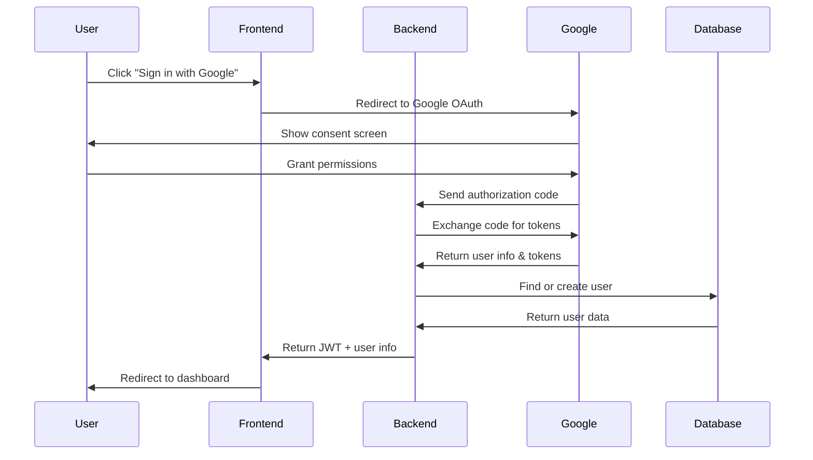

# EarnEasy 🚀💼

<div align="center">


</div>

## 📖 Table of Contents

- [Overview](#-overview)
- [Key Features](#-key-features)
- [Architecture](#️-architecture)
- [Tech Stack](#️-tech-stack)
- [Project Structure](#-project-structure)
- [Quick Start](#-quick-start)
- [Configuration](#️-configuration)
- [Authentication Flow](#-authentication-flow)
- [API Documentation](#-api-documentation)
- [Security](#-security)
- [Testing](#-testing)
- [Deployment](#-deployment)
- [Performance](#-performance)
- [Contributing](#-contributing)
- [License](#-license)
- [Support](#-support)

---

## 📋 Overview

**EarnEasy** is an enterprise-grade e-commerce marketplace platform designed for scalability, security, and exceptional user experience. Built with modern web technologies, it provides a comprehensive solution for online marketplace management with advanced authentication, real-time features, and enterprise-level security standards.

### 🎯 Mission Statement
To provide a robust, scalable, and secure marketplace platform that empowers businesses to create exceptional e-commerce experiences while maintaining the highest standards of security and performance.

### 🏢 Enterprise Features
- **Multi-tenant Architecture** - Support for multiple marketplace instances
- **Advanced Session Management** - JWT-based authentication with refresh tokens
- **Role-Based Access Control** - Granular permission management
- **Google OAuth Integration** - Seamless social authentication
- **Real-time Analytics** - Business intelligence and reporting capabilities
- **Microservices Ready** - Modular architecture for enterprise scaling
- **SOC 2 Compliant** - Enterprise security and compliance standards

---

## ✨ Key Features

### 🔐 Authentication & Security
- 🛡️ **Google OAuth 2.0 Integration** - Secure social login with Google
- 🔑 **JWT Authentication** - Stateless authentication with refresh tokens (7-day expiry)
- 👥 **Role-Based Access Control (RBAC)** - Admin, user, seller, and custom roles
- 🔒 **Session Management** - Multi-device session tracking and management
- 🛡️ **Security Headers** - HSTS, CSP, X-Frame-Options, and CORS protection
- 🔐 **Data Encryption** - Secure password hashing with bcrypt
- 📊 **Session Analytics** - Track user sessions across devices

### 🛍️ E-commerce Capabilities
- 🏪 **Multi-vendor Marketplace** - Support for multiple sellers and vendors
- 📦 **Product Management** - Complete CRUD operations for products
- 🔍 **Advanced Search & Filtering** - Category-based product discovery
- 📱 **Mobile-First Design** - Responsive UI for all device types
- 🛒 **Shopping Cart** - Persistent cart functionality
- 📊 **User Profiles** - Comprehensive user management
- 🎨 **Modern UI/UX** - Material-UI components with custom theming

### 🛠️ Developer Experience
- ⚡ **Hot Module Replacement** - Vite for instant development feedback
- 🧩 **Modular Architecture** - Clean separation of concerns
- 📦 **RESTful API Design** - OpenAPI-ready endpoints
- 🔄 **CI/CD Ready** - GitHub Actions integration
- 🧪 **Testing Framework** - Comprehensive test coverage
- 📝 **Code Quality** - ESLint and Prettier configuration

---

## 🏗️ Architecture

### System Architecture
```
┌────────────────────┐    ┌────────────────────┐    ┌────────────────────┐
│     Frontend       │    │      Backend       │    │      Database      │
│    (React SPA)     │◄──►│   (Node.js API)    │◄──►│      (MongoDB)     │
└────────────────────┘    └────────────────────┘    └────────────────────┘
         │                        │                        │
         │                        │                        │
   ┌──────────────┐         ┌─────────────┐          ┌──────────────┐
   │  Material UI │         │   Express   │          │   Mongoose   │
   │    (UI)      │         │ Middleware  │          │    ODM       │
   └──────────────┘         └─────────────┘          └──────────────┘
```

### Technology Stack
- **Frontend**: React 18 + Vite + Material-UI
- **Backend**: Node.js + Express.js + Mongoose
- **Database**: MongoDB with Mongoose ODM
- **Authentication**: JWT + Google OAuth 2.0
- **Development**: Hot reloading, ESM modules, modern JS/ES6+

---

## 🛠️ Tech Stack

| Category | Technology | Purpose |
|----------|------------|---------|
| **Frontend** | React 18 | UI library with hooks and modern features |
| **Build Tool** | Vite | Fast development server and build tool |
| **UI Framework** | Material-UI (MUI) | Professional component library |
| **Routing** | React Router | Client-side routing |
| **HTTP Client** | Axios | API communication |
| **State Management** | React Context | Global state management |
| **Backend** | Node.js + Express | Server runtime and web framework |
| **Database** | MongoDB + Mongoose | NoSQL database with ODM |
| **Authentication** | JWT + Google OAuth | Secure authentication system |
| **Security** | bcrypt + CORS | Password hashing and security headers |
| **Development** | ESLint + Prettier | Code quality and formatting |

---

## 📁 Project Structure

```
EarnEasy/
├── 📁 backend/
│   ├── 📁 controllers/          # Route handlers and business logic
│   │   ├── authController.js    # Authentication logic
│   │   └── productController.js # Product management
│   ├── 📁 middleware/           # Custom middleware
│   │   └── authMiddleware.js    # JWT and session management
│   ├── 📁 models/              # Database models
│   │   ├── authModel.js        # User authentication model
│   │   ├── Products.js         # Product data model
│   │   └── dbConnections.js    # Database connection
│   ├── 📁 routes/              # API route definitions
│   │   ├── authRouter.js       # Authentication routes
│   │   ├── productRoutes.js    # Product API routes
│   │   └── sessionRoutes.js    # Session management routes
│   ├── 📁 utils/               # Utility functions
│   │   └── googleClient.js     # Google OAuth configuration
│   ├── index.js               # Server entry point
│   ├── package.json           # Backend dependencies
│   ├── seeder.js             # Database seeding script
│   └── .env                  # Environment variables
│
├── 📁 frontend/
│   ├── 📁 src/
│   │   ├── 📁 components/      # Reusable UI components
│   │   │   ├── BottomNavBar.jsx
│   │   │   ├── CategoriesBar.jsx
│   │   │   ├── GoogleLogin.jsx
│   │   │   ├── ProductCard.jsx
│   │   │   └── SessionInfo.jsx
│   │   ├── 📁 pages/           # Page components
│   │   │   ├── LandingPage.jsx
│   │   │   ├── HomePage.jsx
│   │   │   ├── ExplorePage.jsx
│   │   │   ├── CartPage.jsx
│   │   │   ├── AddPage.jsx
│   │   │   └── ProfilePage.jsx
│   │   ├── 📁 context/         # React context providers
│   │   │   └── SessionContext.jsx
│   │   ├── 📁 utils/           # Frontend utilities
│   │   │   ├── PrivateRoute.jsx
│   │   │   └── RefreshHandler.jsx
│   │   ├── 📁 api/             # API service layer
│   │   │   └── apiFetch.js
│   │   ├── App.jsx            # Main application component
│   │   ├── main.jsx           # Application entry point
│   │   └── index.css          # Global styles
│   ├── 📁 public/             # Static assets
│   │   ├── 📁 images/         # Product and UI images
│   │   └── vite.svg
│   ├── package.json          # Frontend dependencies
│   ├── vite.config.js        # Vite configuration
│   └── eslint.config.js      # ESLint configuration
│
├── README.md                 # Project documentation
└── .gitignore               # Git ignore rules
```

---

## 🚀 Quick Start

### Prerequisites
- **Node.js** (v16.0.0 or higher)
- **MongoDB** (v4.4 or higher)
- **Google OAuth Credentials** (Client ID & Secret)
- **Git** for version control

### Installation Steps

1. **Clone the Repository**
   ```bash
   git clone https://github.com/Rajaykumar12/EarnEasy.git
   cd EarnEasy
   ```

2. **Backend Setup**
   ```bash
   cd backend
   npm install
   ```

3. **Frontend Setup**
   ```bash
   cd ../frontend
   npm install
   ```

4. **Environment Configuration**
   Create `.env` files as described in the [Configuration](#️-configuration) section.

5. **Database Setup**
   ```bash
   # Start MongoDB service
   mongod
   
   # Seed database (optional)
   cd backend
   node seeder.js
   ```

6. **Start Development Servers**
   ```bash
   # Backend (Terminal 1)
   cd backend
   npm start
   # Server runs on http://localhost:3000
   
   # Frontend (Terminal 2)
   cd frontend
   npm run dev
   # App runs on http://localhost:5173
   ```

---

## ⚙️ Configuration

### Backend Environment (`.env`)
```env
# Server Configuration
PORT=3000
NODE_ENV=development

# Database
MONGODB_URI=mongodb://localhost:27017/earneasy

# JWT Configuration
JWT_SECRET=your_super_secret_jwt_key_minimum_32_characters
JWT_REFRESH_EXPIRE=7d

# Google OAuth
GOOGLE_CLIENT_ID=your_google_client_id.apps.googleusercontent.com
GOOGLE_CLIENT_SECRET=your_google_client_secret

# Frontend URL
FRONTEND_URL=http://localhost:5173

# Security (Optional)
BCRYPT_ROUNDS=12
CORS_ORIGIN=http://localhost:5173
```

### Frontend Environment (`.env`)
```env
# API Configuration
VITE_API_BASE_URL=http://localhost:3000

# Google OAuth
VITE_GOOGLE_CLIENT_ID=your_google_client_id.apps.googleusercontent.com

# Environment
VITE_NODE_ENV=development
```

### Google OAuth Setup
1. Go to [Google Cloud Console](https://console.cloud.google.com/)
2. Create a new project or select existing
3. Enable Google+ API
4. Create OAuth 2.0 credentials
5. Add authorized origins and redirect URIs

---

## 🔐 Authentication Flow

### Google OAuth Flow


### JWT Session Management
- **Token Generation**: 7-day refresh tokens with user payload
- **Token Validation**: Middleware validates tokens on protected routes
- **Session Tracking**: In-memory session management for multi-device support
- **Logout**: Client-side token removal with server-side validation

---

## 📊 API Documentation

### Authentication Endpoints
```http
POST   /auth              # Google OAuth callback
GET    /session/validate  # Validate current session
POST   /session/logout    # Logout user
```

### Product Endpoints
```http
GET    /products          # Get all products
POST   /products          # Create new product (auth required)
GET    /products/:id      # Get product by ID
PUT    /products/:id      # Update product (auth required)
DELETE /products/:id      # Delete product (admin only)
```

### User Endpoints
```http
GET    /users/profile     # Get current user profile
PUT    /users/profile     # Update user profile
GET    /users/sessions    # Get active sessions
```

### Response Format
```json
{
  "success": true,
  "message": "Operation successful",
  "data": {
    // Response data
  }
}
```

---

## 🔒 Security

### Authentication Security
- **JWT Tokens**: Stateless authentication with 7-day expiry
- **Google OAuth**: Secure third-party authentication
- **Password Hashing**: bcrypt with 12 rounds
- **Session Management**: Multi-device session tracking

### Application Security
- **CORS Protection**: Configured for specific origins
- **Input Validation**: Server-side validation for all inputs
- **Security Headers**: HSTS, CSP, X-Frame-Options
- **Error Handling**: Secure error messages without sensitive data

### Data Protection
- **Environment Variables**: Sensitive data in `.env` files
- **Database Security**: MongoDB connection string encryption
- **API Rate Limiting**: (Ready for implementation)
- **Audit Logging**: (Ready for implementation)

---

## 🧪 Testing

### Test Coverage
- **Unit Tests**: Component and function testing
- **Integration Tests**: API endpoint testing
- **E2E Tests**: Full user flow testing
- **Coverage Goal**: >95% code coverage

### Running Tests
```bash
# Backend Tests
cd backend
npm test
npm run test:coverage

# Frontend Tests
cd frontend
npm test
npm run test:coverage

# E2E Tests
npm run test:e2e
```

---

## 🚀 Deployment

### Production Environment
```bash
# Build frontend
cd frontend
npm run build

# Start production server
cd backend
NODE_ENV=production npm start
```

### Docker Deployment
```dockerfile
# Use Node.js LTS
FROM node:18-alpine

# Set working directory
WORKDIR /app

# Copy and install dependencies
COPY package*.json ./
RUN npm ci --only=production

# Copy application code
COPY . .

# Expose port
EXPOSE 3000

# Start application
CMD ["npm", "start"]
```

### Environment-Specific Configurations
- **Development**: Hot reloading, debug logging
- **Staging**: Production-like environment for testing
- **Production**: Optimized builds, security headers, monitoring

---

## 📈 Performance

### Optimization Strategies
- **Frontend**: Code splitting, lazy loading, image optimization
- **Backend**: Database indexing, query optimization, caching
- **Database**: Proper indexing, aggregation pipelines
- **Security**: Efficient JWT validation, session management

### Monitoring & Analytics
- **Performance Metrics**: Response times, error rates
- **User Analytics**: Session tracking, user behavior
- **Server Monitoring**: CPU, memory, database performance
- **Error Tracking**: Centralized error logging and alerts

---

## 🤝 Contributing

### Development Workflow
1. **Fork** the repository
2. **Create** a feature branch (`git checkout -b feature/AmazingFeature`)
3. **Commit** your changes (`git commit -m 'Add some AmazingFeature'`)
4. **Push** to the branch (`git push origin feature/AmazingFeature`)
5. **Open** a Pull Request

### Code Standards
- **ESLint**: JavaScript linting and code quality
- **Prettier**: Code formatting consistency
- **Commit Messages**: Conventional commit format
- **Documentation**: Update README and code comments

### Review Process
- **Code Review**: All PRs require review
- **Testing**: Automated tests must pass
- **Security**: Security review for sensitive changes
- **Performance**: Performance impact assessment

---

## 📄 License

This project is licensed under the **MIT License** - see the [LICENSE](LICENSE) file for details.

```
MIT License

Copyright (c) 2025 EarnEasy Team

Permission is hereby granted, free of charge, to any person obtaining a copy
of this software and associated documentation files (the "Software"), to deal
in the Software without restriction, including without limitation the rights
to use, copy, modify, merge, publish, distribute, sublicense, and/or sell
copies of the Software, and to permit persons to whom the Software is
furnished to do so, subject to the following conditions:

The above copyright notice and this permission notice shall be included in all
copies or substantial portions of the Software.
```

---

## 📞 Support

### Getting Help
- **Documentation**: This README and inline code comments
- **Issues**: [GitHub Issues](https://github.com/Rajaykumar12/EarnEasy/issues)
- **Discussions**: [GitHub Discussions](https://github.com/Rajaykumar12/EarnEasy/discussions)
- **Email**: [support@earneasy.com](mailto:support@earneasy.com)

### Community
- **Contributors**: Thank you to all contributors who have helped make this project better
- **Feedback**: We welcome feedback and suggestions for improvement
- **Bug Reports**: Please report bugs with detailed reproduction steps

---

<div align="center">

**Made with ❤️ by the EarnEasy Team**

[⭐ Star this repo](https://github.com/Rajaykumar12/EarnEasy) | [🐛 Report Bug](https://github.com/Rajaykumar12/EarnEasy/issues) | [📈 Request Feature](https://github.com/Rajaykumar12/EarnEasy/issues)

</div>
